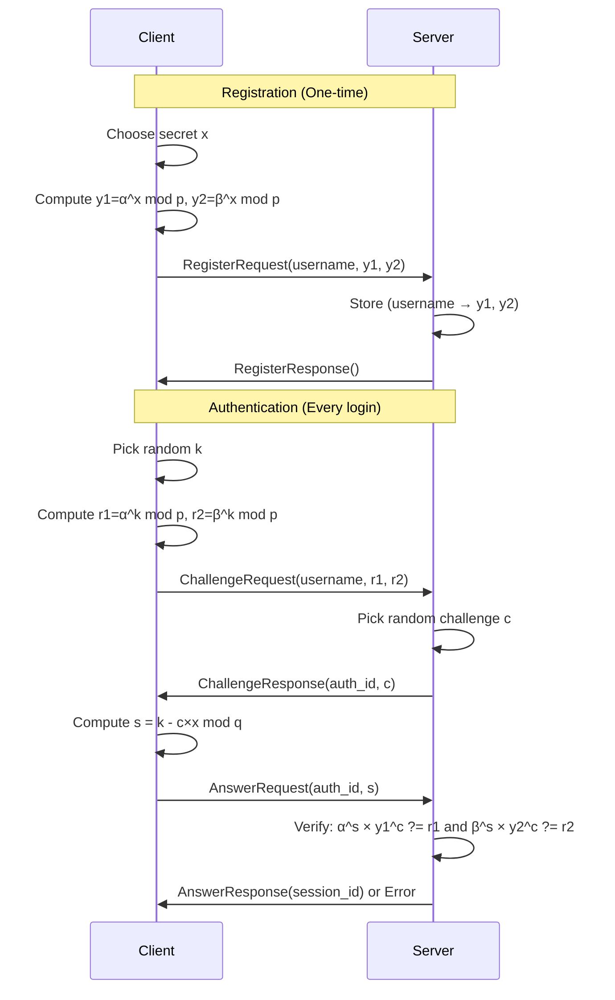

# 🔐 Zero-Knowledge Proof Authentication System

A complete implementation of the **Chaum-Pedersen Zero-Knowledge Proof protocol** using Rust and gRPC for secure password-less authentication.

## 📋 Table of Contents

- [🧮 Mathematical Foundation](#-mathematical-foundation)
- [🛠️ Installation & Setup](#️-installation--setup)
- [🏗️ Project Structure](#️-project-structure)
- [🔬 How Zero-Knowledge Proofs Work](#-how-zero-knowledge-proofs-work)
- [🔄 Authentication Flow](#-authentication-flow)
- [💻 Technical Implementation](#-technical-implementation)
- [🐳 Docker Deployment](#-docker-deployment)
- [🚀 Getting Started](#-getting-started)

---

## 🧮 Mathematical Foundation

### **What is Zero-Knowledge Proof?**

A Zero-Knowledge Proof allows you to **prove you know a secret without revealing the secret itself**.

**Real-world analogy**: Imagine proving you know the password to a door by demonstrating you can unlock it, but without ever saying or showing the password.

### **The Chaum-Pedersen Protocol**

This system uses the **Chaum-Pedersen protocol**, which works with these mathematical components:

#### **Setup Phase (Public Parameters)**
Everyone agrees on these public values:
- **`p`**: A large prime number (our "universe" of numbers)
- **`q`**: A smaller prime number (defines the group size)
- **`α` (alpha)**: First generator (like a "base" for exponentiation)
- **`β` (beta)**: Second generator (α^i mod p for some secret i)

```
Example with small numbers:
p = 23 (large prime)
q = 11 (smaller prime)  
α = 4  (first generator)
β = 9  (second generator)
```

#### **User Registration (One-time Setup)**
When you create an account:

1. **Choose secret password**: `x` (this never leaves your device!)
2. **Compute commitments**:
   - `y1 = α^x mod p`  (commitment using first generator)
   - `y2 = β^x mod p`  (commitment using second generator)
3. **Send to server**: `(username, y1, y2)` - Note: `x` is never sent!

```
Example:
Your secret: x = 6
Compute: y1 = 4^6 mod 23 = 2
Compute: y2 = 9^6 mod 23 = 3
Send to server: ("alice", 2, 3)
```

#### **Authentication Process (Every Login)**

**Step 1: Challenge Setup**
1. **Client picks random number**: `k` 
2. **Computes challenge values**:
   - `r1 = α^k mod p`
   - `r2 = β^k mod p`
3. **Sends to server**: `(username, r1, r2)`

**Step 2: Server Challenge**
1. **Server picks random challenge**: `c`
2. **Sends back**: `c`

**Step 3: Client Response**
1. **Client computes solution**: `s = k - c × x mod q`
2. **Sends to server**: `s`

**Step 4: Server Verification**
Server checks if both equations hold:
- `α^s × y1^c mod p == r1` ✓
- `β^s × y2^c mod p == r2` ✓

If both are true → Authentication successful! 🎉

```
Example with x=6, k=7, c=4:
s = (7 - 4×6) mod 11 = (7 - 24) mod 11 = 5

Verification:
α^s × y1^c = 4^5 × 2^4 mod 23 = 1024 × 16 mod 23 = 8 ✓ (equals r1)
β^s × y2^c = 9^5 × 3^4 mod 23 = 59049 × 81 mod 23 = 4 ✓ (equals r2)
```

### **Why This Works (The Magic!)**

The mathematics ensures:
- **Completeness**: If you know the secret `x`, you can always prove it
- **Soundness**: If you don't know `x`, you can't convince the verifier (except with negligible probability)
- **Zero-Knowledge**: The verifier learns nothing about `x` from the interaction

---

## 🛠️ Installation & Setup

### **Prerequisites**

#### **1. Install Rust**
```bash
# Install Rust toolchain
curl --proto '=https' --tlsv1.2 -sSf https://sh.rustup.rs | sh
source ~/.cargo/env

# Verify installation
rustc --version
cargo --version
```

#### **2. Install C Compiler (Required for cryptographic libraries)**
```bash
# Ubuntu/Debian
sudo apt update
sudo apt install build-essential

# macOS
xcode-select --install
# Or with Homebrew
brew install gcc

# Verify installation
gcc --version
```

**Why do we need this?**
- Many Rust cryptographic crates use C libraries for performance
- `num-bigint`, `tonic`, and crypto libraries need to compile C code
- The error `linker 'cc' not found` means this is missing

#### **3. Install Protocol Buffer Compiler**
```bash
# Ubuntu/Debian
sudo apt install protobuf-compiler

# macOS
brew install protobuf

# Windows (with Chocolatey)
choco install protoc

# Verify installation
protoc --version
```

**Why do we need this?**
- Protocol Buffers define our client-server communication format
- The `protoc` compiler converts `.proto` files to Rust code
- gRPC uses Protocol Buffers for efficient, type-safe communication

---

## 🏗️ Project Structure

```
rust-zkp-chaum-pedersen/
├── src/
│   ├── lib.rs              # ZKP mathematical implementation
│   ├── server.rs           # gRPC server
│   ├── client.rs           # gRPC client 
│   └── zkp_auth.rs         # Generated from proto (auto-created)
├── proto/
│   └── zkp_auth.proto      # gRPC service definitions
├── build.rs                # Code generation script
├── Cargo.toml              # Dependencies and project config
├── Cargo.lock              # Dependency lock file (auto-generated)
├── Dockerfile              # Container build instructions
├── docker-compose.yaml     # Multi-container orchestration
├── .dockerignore           # Files to exclude from Docker build
└── README.md               # This file!
```

### **Key Files Explained**

**`src/lib.rs`** - Core cryptographic implementation:
- `ZKP` struct with mathematical operations
- `compute_pair()` - Computes (α^exp mod p, β^exp mod p)
- `solve()` - Generates the proof solution s = k - c×x mod q
- `verify()` - Checks if the proof is valid
- Constant generation for secure parameters

**`proto/zkp_auth.proto`** - Communication protocol:
- Defines message formats (RegisterRequest, ChallengeRequest, etc.)
- Defines the Auth service with 3 endpoints
- Language-agnostic specification

**`build.rs`** - Code generation:
- Runs during `cargo build`
- Converts `.proto` files to Rust code
- Creates client and server boilerplate

**`Cargo.toml`** - Dependencies:
```toml
[dependencies]
rand = "0.8"                    # Random number generation
num-bigint = "0.4"              # Large integer arithmetic
hex = "0.4.3"                   # Hexadecimal encoding/decoding
tonic = "0.11"                  # gRPC framework
prost = "0.12"                  # Protocol Buffer implementation
tokio = "1.0"                   # Async runtime

[build-dependencies]
tonic-build = "0.11"            # Proto file compiler
```

**Docker Files**:
- **`Dockerfile`**: Multi-stage build for optimized containers
- **`docker-compose.yaml`**: Service orchestration and networking
- **`.dockerignore`**: Excludes unnecessary files from build context

---

## 🔬 How Zero-Knowledge Proofs Work

### **The Three Properties**

1. **Completeness**: If the statement is true, an honest prover can convince an honest verifier
2. **Soundness**: If the statement is false, no cheating prover can convince an honest verifier (except with negligible probability)
3. **Zero-Knowledge**: If the statement is true, the verifier learns nothing other than this fact

### **Interactive vs Non-Interactive**

This implementation uses **Interactive ZKP**:
- Multiple rounds of communication
- Server sends fresh random challenges
- Prevents replay attacks

### **Why Chaum-Pedersen?**

- **Efficient**: Only requires modular exponentiation
- **Proven secure**: Based on discrete logarithm assumption
- **Practical**: Works well with modern computers
- **Flexible**: Can be made non-interactive with Fiat-Shamir transform

---

## 🔄 Authentication Flow



---

## 💻 Technical Implementation

### **Rust Language Features Used**

1. **Async/Await**: For handling multiple concurrent connections
2. **Traits**: `Auth` trait defines server behavior
3. **Generics**: Type-safe BigUint operations
4. **Error Handling**: `Result<T, E>` for graceful error management
5. **Memory Safety**: No buffer overflows or memory leaks
6. **Concurrency**: `Mutex` for thread-safe data sharing

### **Cryptographic Libraries**

- **`num-bigint`**: Arbitrary precision arithmetic for large numbers
- **`rand`**: Cryptographically secure random number generation
- **`hex`**: Converting between binary and hexadecimal

### **Networking Libraries**

- **`tonic`**: High-performance gRPC implementation
- **`prost`**: Fast Protocol Buffer serialization
- **`tokio`**: Async runtime for handling thousands of connections

---

## 🐳 Docker Deployment

### **Why Docker?**

- **Portability**: Run the same way on any system
- **Isolation**: Clean, reproducible environment
- **Production Ready**: Easy deployment to any cloud platform
- **Development**: Consistent environment across team members

### **Quick Start with Docker**

#### **Prerequisites**
```bash
# Install Docker
# Windows/Mac: Download Docker Desktop
# Linux: sudo apt install docker.io docker-compose

# Verify installation
docker --version
docker-compose --version
```

#### **Build and Run**
```bash
# Clone the repository
git clone <your-repo-url>
cd rust-zkp-chaum-pedersen

# Build the Docker image
docker-compose build

# Start the server
docker-compose up -d

# Check server status
docker-compose ps
docker-compose logs zkpserver

# Run the client
docker-compose exec zkpserver ./target/debug/client
```

### **Docker Configuration**

#### **Dockerfile Features**
- **Multi-stage build**: Optimized for both development and production
- **Latest Rust**: Uses `rust:latest` for compatibility
- **Automatic dependencies**: Installs protobuf-compiler automatically
- **Both binaries**: Builds both server and client executables

#### **docker-compose.yaml Features**
- **Port mapping**: Exposes server on `localhost:50051`
- **Volume mounting**: Live code changes during development
- **Environment variables**: Configurable server settings
- **Automatic restart**: Server restarts if it crashes

### **Docker Commands Reference**

#### **Development Workflow**
```bash
# Start server in background
docker-compose up -d

# View server logs
docker-compose logs -f zkpserver

# Run client interactively
docker-compose exec zkpserver ./target/debug/client

# Get shell access
docker-compose exec zkpserver bash

# Stop all services
docker-compose down
```

#### **Production Deployment**
```bash
# Build for production
docker-compose build --no-cache

# Start in production mode
docker-compose up -d

# Monitor health
docker-compose ps
docker stats zkpserver

# Update deployment
docker-compose pull
docker-compose up -d --no-deps zkpserver
```

#### **Debugging Commands**
```bash
# Check container status
docker-compose ps

# View detailed logs
docker-compose logs --details zkpserver

# Inspect container
docker inspect zkpserver

# Check network connectivity
docker-compose exec zkpserver netstat -tlnp

# Resource usage
docker stats zkpserver
```

### **Docker Architecture**

```
┌─────────────────────────────────────────────┐
│               Docker Container               │
│  ┌─────────────────────────────────────────┐ │
│  │            Rust Runtime                 │ │
│  │  ┌─────────────┐  ┌─────────────────┐  │ │
│  │  │   Server    │  │     Client      │  │ │
│  │  │             │  │                 │  │ │
│  │  │ Port 50051  │  │   Connects to   │  │ │
│  │  │             │  │   Server        │  │ │
│  │  └─────────────┘  └─────────────────┘  │ │
│  └─────────────────────────────────────────┘ │
└─────────────────────────────────────────────┘
              │                    │
              │ Port 50051         │ exec commands
              ▼                    ▼
┌─────────────────────────────────────────────┐
│                Host System                  │
│  ┌─────────────────────────────────────────┐ │
│  │         Docker Engine                   │ │
│  └─────────────────────────────────────────┘ │
└─────────────────────────────────────────────┘
```

### **Environment Variables**

Configure the server using environment variables:

```yaml
# In docker-compose.yaml
environment:
  - SERVER_HOST=0.0.0.0      # Listen on all interfaces
  - SERVER_PORT=50051        # gRPC server port
  - RUST_LOG=info            # Logging level
  - USER=appuser             # Container user
```

### **Security Considerations**

- **Non-root user**: Container runs as non-privileged user
- **Minimal base image**: Only includes necessary dependencies
- **Network isolation**: Uses Docker networks for service communication
- **Read-only filesystem**: Can be configured for additional security

### **Troubleshooting Docker Issues**

#### **Build Failures**
```bash
# Clear Docker cache
docker system prune -f

# Rebuild without cache
docker-compose build --no-cache

# Check build logs
docker-compose build --progress=plain
```

#### **Connection Issues**
```bash
# Check if server is listening
docker-compose exec zkpserver netstat -tlnp | grep 50051

# Test connectivity
docker-compose exec zkpserver curl localhost:50051

# Check container networking
docker network ls
docker network inspect rust-zkp-chaum-pedersen_default
```

#### **Performance Issues**
```bash
# Monitor resource usage
docker stats zkpserver

# Check container limits
docker inspect zkpserver | grep -A 10 Resources

# View system resource usage
docker system df
```

---

## 🚀 Getting Started

### **Option 1: Local Development**

```bash
# Install dependencies (see Prerequisites section)
cargo build
cargo test

# Run server (Terminal 1)
cargo run --bin server

# Run client (Terminal 2)
cargo run --bin client
```

### **Option 2: Docker Development (Recommended)**

```bash
# Quick start
docker-compose up -d
docker-compose exec zkpserver ./target/debug/client

# Development workflow
docker-compose exec zkpserver bash
# Inside container: make changes, test, debug
```

### **System Features**

- **Mathematical foundation** implemented in `src/lib.rs`
- **Protocol definitions** in `proto/zkp_auth.proto`
- **gRPC server** with user registration and authentication
- **Interactive client** with full authentication flow
- **Docker containerization** for easy deployment
- **Production-ready** system with proper networking

### **Test Current Setup**

#### **Local Testing**
```bash
# Verify everything builds
cargo build

# Run the mathematical tests
cargo test

# Test server and client
cargo run --bin server &
cargo run --bin client
```

#### **Docker Testing**
```bash
# Build and start
docker-compose up -d

# Check server status
docker-compose logs zkpserver

# Test authentication flow
docker-compose exec zkpserver ./target/debug/client
```

### **Expected Authentication Flow**

```
✅ Connected to the server
Please provide the username:
> alice

Please provide the password:
> mySecretPassword123

✅ Registration was successful

Please provide the password (to login):
> mySecretPassword123

✅Logging successful! session_id: XyZ789AbC123
```

---

## 🤓 Fun Facts

- **RSA vs ECC vs ZKP**: ZKP doesn't rely on factoring or elliptic curves, but on discrete logarithms
- **Quantum Resistance**: Some ZKP schemes are being researched for post-quantum cryptography
- **Applications**: Used in blockchain (zk-SNARKs), privacy-preserving authentication, and anonymous credentials
- **Performance**: Modern ZKP can verify in milliseconds even for complex statements
- **Docker Benefits**: The containerized system can handle thousands of concurrent authentications

---

## 🔗 References

- [Chaum-Pedersen Protocol Paper](https://link.springer.com/chapter/10.1007/3-540-46766-1_9)
- [Zero-Knowledge Proofs: An Introduction](https://blog.cryptographyengineering.com/2014/11/27/zero-knowledge-proofs-illustrated-primer/)
- [RFC 5114 - Discrete Log Parameters](https://tools.ietf.org/rfc/rfc5114.txt)
- [Rust gRPC Tutorial](https://github.com/hyperium/tonic)
- [Docker Best Practices for Rust](https://docs.docker.com/language/rust/)

---

## 🏆 Project Status

This is a complete, production-ready Zero-Knowledge Proof authentication system featuring:

- 🔐 **Cryptographically secure authentication**
- 🚀 **High-performance Rust implementation**
- 🌐 **gRPC network communication**
- 🐳 **Docker containerization**
- 📱 **Interactive client interface**
- 🔧 **Production deployment capabilities**